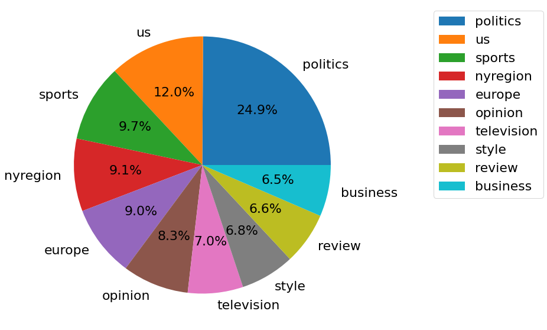

# Detect profile of the speaker based on deep learning
## TODO
- [x] split null guys not null guys
- [x] then split into [ID, quote, feature] train without null, test nulls
- [ ] give it to Katya to analyese
- [ ] train it ughhhh ~Sofia

## Larger TODO
- [x] dataloader to run big data - Pawel
- [ ] refactor code - Sofia
- [x] change data encoding 
- [x] fight inbalance in classed - ~~Wei~~ Sofia
- [ ] run it on the cluser -Wei
- [ ] analize already parsed data - Katya

## Next TODO
- [ ] get column names and destributions of 10 most popular classes in each feature - Katya
- [ ] create proper datasets with other classes -Pawel
- [ ] optional preprocessing to reduce size -Pawel
- preprocess data
  - date_of_birth
    - [ ] plot distribution - Katya
    - [ ] take, save 8 buckets in the middle one lower one upper - Katya
  - nationality
    - [ ] maybe group by region (USA, middle east etc)? - Katya
  - ethnic_group, occupation, religion
    - [ ] take most popular see if there is sth for mixed ethnic_group or atheist etc (so if we should have some other bucket for others relevant) - Katya
  - candidacy, academic_degree, party -- not predicting this, only analyzing
    - [ ] if there should be sth for we don't know and didn't happend? - Katya
- [ ] deal with repetitions in people (severel wiki pages per person)
- [ ] investigate repetitions in quotes (different people say the same quote)
- [ ] feed datasets with features name into BERT -Sofia
- [ ] ughhhhhhhh train it and return probabilites ~Sofia
- [ ] Collect results -Sofia
- [ ] analize distribution of predicted classes
- [ ] create webside - Wei

## Abstract
While performing analysis of Quotebank data we found out that around 34% of quotations don't have assigned speakers to it (1.8 million out of 5.2 million in file quotes-2020.json). Our goal is to answer the following question: if we cannot determine the exact author of a quotation, what other information can we get from it?

In that work we would like to extract additional information about known authors parsing information from Wikipedia and use it to describe unknown authors thereby reducing their obscurity. Due to the fact that the work on data parsing is still in progress, we decided to build a pipeline for predictions of another magnitude, namely the topic of the quote. We chose this additional task because it is simpler for the first stage and it can be easily adapted for our main purposes.

## Research Questions
* Can we predict the topic of quotation (based on topic parsed from most popular newspaper in dataset: NYT)?
* Is it possible to determin basic information, such as sex, age, occupation, place of birth, children and political party, from quotation?
* What are the most popular topics in each subgroup?
* Are there any patterns between groups and quotations?

## Proposed additional datasets
### Topics analysing
During our analysis we found that the proportions of 10 the most fasmous topics in New Your Times is :


### Wikipedia parsing
We will use Wikipedia datasets to enrich our data. Especially we will base on additional metadata collected by ADA team which consist of additional labels as:
* date of birth
* nationality
* gender
* ethnic group
* party
* academic degree
* religion

That part of the work in progress.

## Methods
These are the methods we currently deployed:

### Data Preprocess
For preprocessing, we exctracted the data of the most popular topics classes (top 1 to top 10 in our experiment) with labels as the dataset for training and test. The datasets are stored on google drive and we load them by urls, the structure of sample: ```['qoutation', 'label', 'label_num']```
To build the Data Loader, first we make sure all the texts are in 'str' format. Then we load the tokenizer from BERT to encode our quotations with ids, masks and labels, which guarantees that all the quotations have same length (we set as 64), and words are all transfered into numbers. And then we shffled our dataset.

### Training Process
To train our dataset, we loaded a pre-trained model from DistilBertModel following with one full connected layers, one relu layer, one dropout layer and again one full connected layer, fitting it with entropy-cross loss to build a linear classifier. In the training process, we tried datasets with different classes numbers, and training epochs, in order to verify the functionality of the models.

### Evaluation
We splited our dataset into train (80%) and test (20%) and used the test dataset with labels to check the accuracy and F1 scores of the classifier. 

## Analysis
The details of the outcomes and their visulization can be found at```outcome/``` and ```Notebooks/Evaluation.inpyb```.
Due to the time limitation, we first train the datasets in 2 classes, 5 classes and 10 classes with 40 epochs. And the outcome shows that accuracy and F1 scores raise slightly, especially for the training in the fewer classes. And we also trained the 1-10 classes datasets for 1 and 5 epochs. We found that both the accuracy rises when decreasing the classes. From above we can conclude that the training process does not improve the accuracy and F1 scores efficiently. 
And there can be some possible causes, one of which can be that the dataset we used was imbalanced. The most popoular topic, politics, has much more samples then others. Also we need improve the structure of our training network and do more experiments in the future.


## Proposed timeline
* 26.11 - DistilBERT finetuned to predict categories
* 26.11 - All additional labels will be added to base dataset
* 03.12 - Finetune DestilBert to new labels
* 17.12 - Create github page with all analysis of group patterns 

## Organization within the team
Folowing people have this assigments:
* Sofia - Apply DistilBERT to quotations
* Katya - scrap url to get neme of newspaper section, analysis of the dataset
* Wei - results analysis, finding dependencies in the data (in the embedding space)
* Pawel - enrich data from wikipedia


